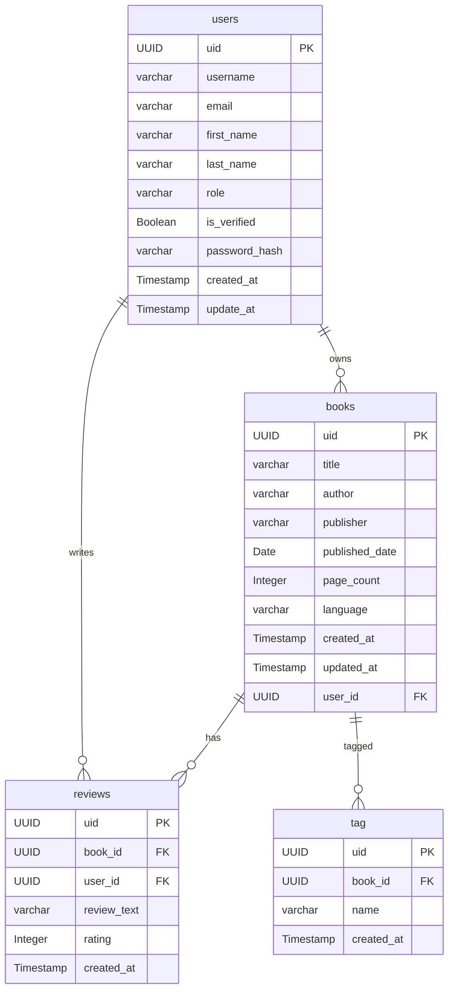

# FastAPI with CRUD operations

### Project purpose

Start by setting up a FastAPI project and running a simple web server. Then, progress to more advanced topics, including building REST APIs, handling path and query parameters, and working with databases using SQLModel. Additionally, explore managing settings with Pydantic, organizing your API with routers, and implementing asynchronous SQLModel connections.

### ERD of the project

### Tech stack & workflow

- FastAPI
- Postgresql by [NEON](https://neon.tech/docs/guides/python) COULD BD (Set your Postgresql db in cloud)
- ORM managed by SQLAlchemy
- Data validating managed by Pydantic
- CRUD With SQLModel
- Alembic for migrations, offers good template for using async DB
- passlib for password hashing
- pydantic for data validation and settings management
- pyjwt for JWT token management
- Connect cloud Redis with FastAPI, set up Redis in cloud
- Error Handling
- Create custom API Exceptions
- Creating a custom logging middleware
- Adding CORS Middleware
- Setting Up FastAPI-Mail
- User account verification
- Password Resets
- FastAPI Background Tasks
- Background Tasks with Celery and Redis
- Celery Monitoring With Flower
- API Documentation with SwaggerUI and Redoc
- API Testing
- Unit testing with Unittest Mock and Pytest
- Document-driven Testing with Schemathesis
- Deployment on Render.com

### Project setup
1. Clone the project repository:
```bash
git clone https://github.com/yanliu1111/fastapi-crud-app.git
```

2. Navigate to the project directory:
```bash
cd fastapi-crud-app/
```

3. Create a virtual environment:
```bash
python3 -m venv env
source env/bin/activate
```

4. Install the required dependencies:
```bash
pip install -r requirements.txt
```
5. Create a `.env` file in the root directory and add Neon database URL:
```bash
DATABASE_URL=postgresql://<username>:<password>@<host>:<port>/<database_name>
JWT_SECRET=#reference 8👉
JWT_ALGORITHM=HS256
```
6. Run database migrations to initialize the database schema:
```bash
alembic revision --autogenerate -m"add tag table"
alembic upgrade head
```
7. Run the FastAPI application:
```bash
fastapi dev src/
```
8. 👉JWT token generation:
```bash
python
import secrets
secrets.token_hex(16)
```
9. Redis connection:
```js
// in config.py
import os
class Settings(BaseSettings):
    model_config = SettingsConfigDict(env_file=".env", extra="ignore")
    DATABASE_URL: str
    JWT_SECRET: str
    JWT_ALGORITHM: str
    REDIS_HOST: str = os.getenv("REDIS_HOST", "localhost")
    REDIS_PORT: int = int(os.getenv("REDIS_PORT", 6379))
    REDIS_PASSWORD: str = os.getenv("REDIS_PASSWORD", "")
```

10. Role-Based Access Control  
    Admin <br>
    [
        "adding User",
        "change roles",
        ”crud on users",
        "book submission",
        "crud on books",
        "crud on reviews",
        "revoke access",
    ]<br>
    User<br>
    [
        "crud on their own books submission",
        "crud on their own reviews",
        "crud on their own account",
    ]
11. **lazy loading** - available via lazy = 'select' or the `lazyload()` option, this is the form of loading that emits a SELECT statement at attribute access time to lazily load a related reference on a signle object at a time. Lazy loading is detailed at lazy loading. 
12. 